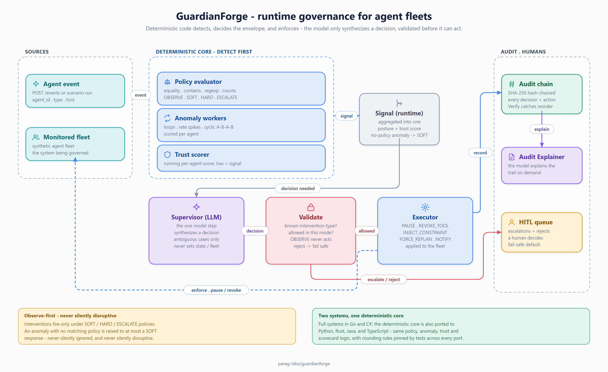

# Design

Why GuardianForge is built the way it is, the trade-offs taken on purpose, and what it
deliberately is **not**. This applies to both the Go and C# implementations, which share
the same design and acceptance criteria.



*The whole system on one page — deterministic detectors, the single model step, the validator
that gates it, and the hash-chained audit. Source: [`docs/diagrams/architecture.svg`](docs/diagrams/architecture.svg).*

## The one rule

> Deterministic code detects, decides the enforcement envelope, and executes. The model
> only synthesizes a decision — and that decision is validated before it can act.

A governance system is the last place you want free-form model output driving actions. So
GuardianForge confines the model to a single synthesis step and wraps it in determinism on
both sides: deterministic detectors produce the signal it reasons over, and a deterministic
validator gates the decision it returns.

## Separation of deterministic vs probabilistic paths

```
event → policy + anomaly + trust  →  supervisor (model)  →  validate  →  execute + audit
        └────── deterministic ─────┘   └── probabilistic ─┘  └──────── deterministic ──────┘
```

- **Policy evaluation** is structured rules (equality, contains, regexp, windowed counts),
  not natural language and not a model. It is fast, exact, and runs first.
- **Anomaly detection** is statistical/pattern based — loops, rate spikes, cyclic patterns —
  scored per agent.
- **Trust** is a deterministic running score; low trust is itself a signal.
- **The supervisor** is the one model step. It receives the aggregated signal and returns a
  decision. It never sets state, never runs an intervention, and never sees the fleet.
- **Validation** is the trust boundary: the decision's intervention type must be one of the
  known types, and an `OBSERVE`-mode policy can never produce an intervention no matter what
  the model says. A rejected decision fails safe — to "no action" under observe, or to human
  escalation under a stricter mode.
- **Execution and audit** are deterministic: the executor changes fleet state, and every
  decision and action is SHA-256 hash-chained into a tamper-evident log.

## The specialist agents

The spec describes seven specialist roles. In this implementation they map cleanly onto the
deterministic/AI split rather than being seven separate model calls:

| Role | Realized as |
|------|-------------|
| Supervisor | the one model synthesis step, with a validated decision |
| Policy Enforcer | the deterministic `policy` evaluator (LLM only for genuinely ambiguous cases) |
| Anomaly Interpreter | the deterministic `anomaly` detectors feeding the signal |
| Trust Scorer | the deterministic `trust` scorer |
| Escalation | the decision's `escalate` flag + the HITL queue in `runtime` |
| Audit Explainer | the model's `Explain` method over the audit trail |
| Conflict Mediator | reserved (a stretch role; the single-supervisor design covers the MVP) |

Keeping the deterministic roles deterministic is the point: they are the parts that must be
exact, and they don't need a model.

## Decisions taken on purpose

- **Structured rules, not CEL or NL.** Rules are field/op/value with windowed counts. This
  keeps the evaluator exact and fast; natural-language policy interpretation is exactly the
  place the spec reserves for the LLM, and it's the only place it's used.
- **Hash-chained audit over anything heavier.** A SHA-256 chain is tamper-*evident* and
  dependency-free; the spec explicitly rules out ZK proofs and blockchain anchoring for v1.
- **A deterministic mock supervisor.** The mock isn't a canned transcript; it's the same
  policy-mode → decision mapping a real model is asked to produce, so the whole system runs
  and the evaluation is meaningful with no API key.
- **Observe-first.** The engine can run in pure monitoring mode; interventions only happen
  under `SOFT`/`HARD`/`ESCALATE` policies, and an anomaly with no matching policy is bumped
  to at most a soft response — never silently ignored, never silently disruptive.
- **Standard library first.** `net/http`, `log/slog`, a tiny metrics registry — no web or
  metrics framework.

## Non-goals (v1)

- **Not a production SaaS control plane.** No multi-tenancy, billing, or persistence. The
  monitored fleet is synthetic, by design, so behaviour is provable.
- **No deep framework integrations.** A clean adapter boundary (the `fleet` package) instead
  of bespoke integrations with every agent framework.
- **No LLM training or fine-tuning.**
- **No cryptographic ZK proofs or blockchain anchoring.** A hash-chained log is sufficient
  for a tamper-evident v1.
- **No cross-language runtime interop.** The Go and C# versions are independent, self-
  contained systems that happen to share a design.
- **The mock is a stand-in, not a model.** 100% scores reflect the fixed scenarios and the
  rule-based supervisor; a live model keeps the same harness but the numbers become a real
  quality signal.

The goal is a small, honest, fully-tested governance *application* that demonstrates the one
thing that matters when a model supervises other agents: a hard, deterministic boundary
around what the model is allowed to decide, and a tamper-evident record of everything it did.
