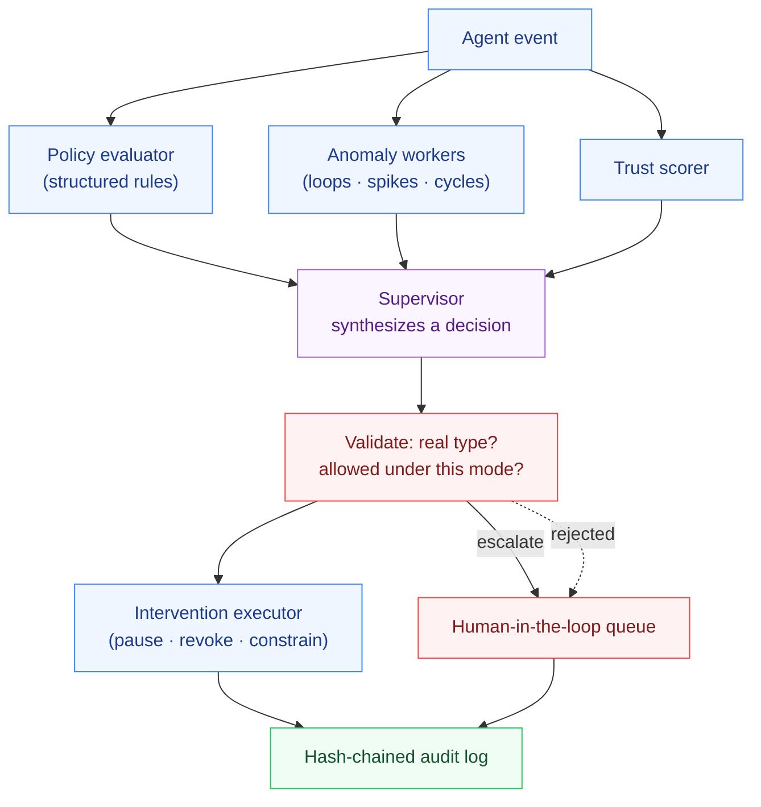

<h1 align="center">GuardianForge</h1>

<p align="center"><strong>Runtime governance for multi-agent AI systems — in Go and C#</strong></p>

<p align="center">A supervisory layer that watches other AI agent fleets, detects policy violations,
anomalous behaviour, and trust decay, and intervenes — observe, constrain, block, or
escalate — with every decision recorded in a tamper-evident audit trail. Deterministic
code decides and enforces; the model is used only for synthesis.</p>

---

## Why this exists

Multi-agent systems fail at high rates, and most of those failures are coordination and
verification gaps rather than a single agent being "wrong": an agent loops forever, quietly
escalates its own privileges, calls a destructive tool, or leaks data — and nothing is
watching the *fleet* as a whole. GuardianForge is that watcher. It sits beside the agents,
evaluates every event against policy, scores anomalies and trust, and takes the smallest
effective action, from a notification up to pausing an agent or escalating to a human.

The design rule is the one that makes an AI-in-the-loop control system trustworthy:

> **Deterministic code detects, decides the envelope, and enforces. The model only
> synthesizes a decision — and that decision is validated before it can act.**

Policy evaluation, anomaly scoring, trust, the audit chain, and intervention execution are
all deterministic Go/C#. The supervisor agent (the one LLM step) proposes a decision, and a
validator rejects anything it isn't allowed to do — a hallucinated intervention type, or an
attempt to intervene under an observe-only policy — failing safe to a human.

## Two implementations

GuardianForge is implemented **fully and independently in two languages**, sharing the same
design, agent roles, and acceptance criteria:

| Version | Language | Status | Location |
|---------|----------|--------|----------|
| GuardianForge-Go | Go 1.24+ | ✅ complete, CI-green | [`go/`](go/) |
| GuardianForge-C# | .NET 8+ | see [`csharp/`](csharp/) | [`csharp/`](csharp/) |

Each language folder is a fully independent, runnable system.

## The governance loop



Every event flows through the deterministic detectors first; the supervisor synthesizes a
decision; the validator gates it; the executor enforces it on the monitored fleet; and the
audit log chains it all.

## Demo

```bash
cd go && go run ./cmd/guardianforge &

# a destructive tool call is caught by a HARD policy and the tool is revoked:
curl -s localhost:8080/events -d '{"agent_id":"reaper","type":"TOOL_CALL","tool":"delete_database"}' | jq '.decision, .intervention.parameters'
```

```json
{ "intervene": true, "type": "REVOKE_TOOL", "reason": "hard policy; revoking tool \"delete_database\"", "confidence": 0.9 }
{ "tool": "delete_database" }
```

A privilege-escalation request escalates to a human; an infinite tool loop is interrupted;
a PII-tagged result injects a constraint; a well-behaved agent is left entirely alone.

## What it detects and does

- **Policy violations** — structured rules (equality, contains, regexp, windowed counts)
  evaluated deterministically, with four enforcement modes: `OBSERVE`, `SOFT`, `HARD`,
  `ESCALATE`.
- **Behavioral anomalies** — tool loops, rate spikes, and cyclic A-B-A-B patterns, scored
  per agent.
- **Trust decay** — a running per-agent score that drops on violations/anomalies and drives
  isolation when it bottoms out.
- **Interventions** — `PAUSE`, `REVOKE_TOOL`, `INJECT_CONSTRAINT`, `FORCE_REPLAN`, `NOTIFY`,
  `ESCALATE`, applied to the monitored fleet.
- **Tamper-evident audit** — every decision and intervention is SHA-256 hash-chained; any
  edit or reordering is caught by `Verify`.

## Evaluation

Both implementations are scored against the same synthetic failure scenarios (infinite
loop, privilege escalation, destructive tool, data leak, and a healthy control):

```
GuardianForge Governance Evaluation

Scenarios:                 5
Detection accuracy:        100%
Intervention correctness:  100%
False positives:           0
Audit chain intact:        yes
```

The build fails on any false positive (intervening on a healthy agent), a missed detection,
or a broken audit chain. Because the deterministic core and the mock supervisor are exact,
these are enforced in CI with no API key.

## Design

See **[DESIGN.md](DESIGN.md)** for the deterministic/AI split, the specialist-agent roles,
the trade-offs taken on purpose, and the explicit non-goals (a governance *application* over
a synthetic fleet, not a production SaaS control plane).

## License

MIT — see [LICENSE](LICENSE).
